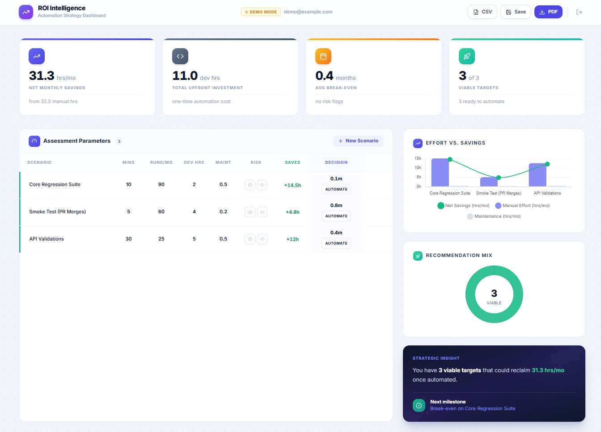

<div align="center">

# Test Automation ROI Intelligence Platform

**A full-stack dashboard that helps engineering managers and QA leads make data-driven decisions about test automation. Input your test scenarios and get instant break-even timelines, risk flags, and ROI projections — no spreadsheet required.**

🚀 **[Try the Live Demo Here](https://mynameisedi.github.io/test-automation-roi-calculator/)**




</div>

## Features

- **Live ROI calculations** — net monthly savings, break-even months, and recommendations update as you type
- **Net Savings column** — per-scenario `+Xh/mo` or `-Xh/mo` displayed inline
- **Risk flagging** — mark scenarios as Flaky (unstable) or Visual (subjective) to surface high-risk automations
- **Recommendation engine** — `Automate` / `Viable` / `Low Priority` / `High Risk` / `Keep Manual` per scenario
- **Duplicate row** — clone any scenario with one click
- **CSV export** — download all scenarios with calculated fields
- **PDF export** — generate a full-dashboard PDF report
- **Combo chart** — bar chart of manual effort vs. maintenance cost with a net savings line overlay
- **Recommendation mix donut** — visual breakdown of your scenario portfolio
- **Unsaved changes indicator** — badge in the header when there are uncommitted edits
- **Toast notifications** — non-blocking feedback for save, export, and error events
- **Two modes** — Supabase-backed persistence for real accounts, or localStorage Demo Mode (no account needed)

## Tech Stack

| Layer | Technology |
|-------|-----------|
| Framework | Next.js 15 (App Router, static export) |
| Styling | Tailwind CSS + Framer Motion |
| Database / Auth | Supabase (PostgreSQL + Row Level Security) |
| Charts | Chart.js + react-chartjs-2 |
| Export | jsPDF + html2canvas |
| Icons | Lucide React |
| Deployment | GitHub Pages |

## Project Structure

```
├── app/
│   ├── page.js          # Main dashboard
│   ├── auth/page.js     # Login, signup, demo mode
│   └── globals.css      # Tailwind + component classes
├── components/
│   ├── ROIChart.js      # Combo bar + line chart
│   └── RecommendationChart.js  # Donut chart
├── lib/
│   ├── supabase.js      # Supabase client
│   └── calc.js          # Pure calculation functions
└── .github/workflows/
    ├── deploy.yml       # Deploy to GitHub Pages on push to main
    └── ci.yml           # Lint + build check on PRs
```

## Getting Started

### 1. Supabase Setup (optional — skip for Demo Mode)

1. Create a project at [supabase.com](https://supabase.com) and note your **Project URL** and **anon public key** from **Project Settings → API**.

2. Run the following in the Supabase **SQL Editor**:

```sql
CREATE TABLE scenarios (
  id UUID DEFAULT gen_random_uuid() PRIMARY KEY,
  user_id UUID REFERENCES auth.users(id) ON DELETE CASCADE NOT NULL,
  name TEXT NOT NULL,
  manual_mins FLOAT DEFAULT 0,
  frequency FLOAT DEFAULT 0,
  dev_hours FLOAT DEFAULT 0,
  maint_hours FLOAT DEFAULT 0,
  is_flaky BOOLEAN DEFAULT false,
  is_visual BOOLEAN DEFAULT false,
  created_at TIMESTAMPTZ DEFAULT now()
);

ALTER TABLE scenarios ENABLE ROW LEVEL SECURITY;

CREATE POLICY "Users can view their own scenarios"    ON scenarios FOR SELECT USING (auth.uid() = user_id);
CREATE POLICY "Users can insert their own scenarios"  ON scenarios FOR INSERT WITH CHECK (auth.uid() = user_id);
CREATE POLICY "Users can update their own scenarios"  ON scenarios FOR UPDATE USING (auth.uid() = user_id);
CREATE POLICY "Users can delete their own scenarios"  ON scenarios FOR DELETE USING (auth.uid() = user_id);
```

3. For local development, disable email confirmation under **Authentication → Providers → Email**.

### 2. Environment Variables

Create a `.env` file in the project root:

```env
NEXT_PUBLIC_SUPABASE_URL=your_supabase_project_url
NEXT_PUBLIC_SUPABASE_ANON_KEY=your_supabase_anon_public_key
```

For GitHub Pages deployment, add these as **repository secrets** (`Settings → Secrets → Actions`):
- `NEXT_PUBLIC_SUPABASE_URL`
- `NEXT_PUBLIC_SUPABASE_ANON_KEY`

### 3. Install & Run

```bash
npm install --legacy-peer-deps
npm run dev
```

Open [http://localhost:3000](http://localhost:3000). To skip Supabase setup entirely, click **Try Demo Mode** on the auth page.

## Usage

### Scenario table

| Field | Description |
|-------|-------------|
| **Manual Mins** | Time to run the test manually once |
| **Runs/Mo** | How many times it runs per month |
| **Dev Hrs** | One-time cost to automate |
| **Maint Hrs** | Ongoing monthly maintenance |
| **Risk flags** | Bug = flaky/unstable, Eye = visual/subjective |

The **Net Savings** and **Break-Even** columns update live. Hover a row to reveal **Duplicate** and **Delete** actions.

### Recommendation logic

| Label | Condition |
|-------|-----------|
| `Automate` | Break-even ≤ 3 months |
| `Viable` | Break-even ≤ 6 months |
| `Low Priority` | Break-even > 6 months |
| `High Risk` | Flaky or visual flag is set |
| `Keep Manual` | Net savings ≤ 0 |

### Exporting

- **Save** — persists to Supabase (or localStorage in Demo Mode)
- **CSV** — exports all scenarios with calculated fields
- **Export PDF** — captures the full dashboard as a PDF

## CI / CD

| Workflow | Trigger | What it does |
|----------|---------|-------------|
| `deploy.yml` | Push to `main` | Builds with `--legacy-peer-deps`, injects Supabase secrets, deploys to GitHub Pages |
| `ci.yml` | PRs to `main`, pushes to other branches | Lint + build check |

## Contributing

Fork the repo and open a pull request. For significant changes, open an issue first to discuss the approach.
